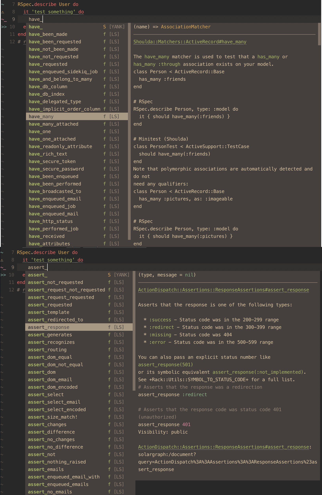

# Changelog

All notable changes to this project will be documented in this file.

The format is based on [Keep a Changelog](https://keepachangelog.com/en/1.1.0/),
and this project adheres to [Semantic Versioning](https://semver.org/spec/v2.0.0.html).

## [Unreleased]

- Update testing steps in developer documentation

## [0.5.3] - 2025-09-02

### Fixed

- Fix local variable bindings (#16)
- Fix implicit subject generation for string descriptions (#17)

### Changed

- Loosen solargraph dependency version >0.52.0
- Use solargraph's parser (#11)

## [0.5.2] - 2025-06-26

### Fixed

- Prevent issues for solargraph prism update (c574b4d)

## [0.5.1] - 2025-04-05

### Fixed

- Exclude doc/ directory from gemspecs - reduce gem size

## [0.5.0] - 2025-04-05

### Changed

- Require ruby >=3 and update gems
- Re-use RSpec method definitions directly from source YARD definitions (#9)
  - Fixes also class methods inheritance inside `context/describe` blocks

## v.0.4.1 - 2025-01-28

### Fixed

- (Hot)fix parsing and type inference for solargraph v0.51.x and ruby v3.4.x (008d3ea and 414bc8e)

## v.0.4.0 - 2024-08-25

### Added

- Support for 3rd party helpers from most known RSpec extension libraries.
  - [rspec-mocks](https://github.com/rspec/rspec-mocks)
  - [rspec-rails](https://github.com/rspec/rspec-rails)
  - [webmock](https://github.com/bblimke/webmock)
  - [shoulda-matchers](https://matchers.shoulda.io/)
  - [rspec-sidekiq](https://github.com/wspurgin/rspec-sidekiq)
  - [airborne](https://github.com/brooklynDev/airborne)
  - <details><summary>📸</summary>
    
    </details>

- Implement RSpec [one-liner syntax](https://rspec.info/features/3-12/rspec-core/subject/one-liner-syntax/) helpers: `is_expected`, `should` and `should_not`
  - <details><summary>📹</summary>
    
    </details>

## v0.3.0 - 2024-07-10

### Added

- Added `example_methods` as a configuration option to add your own example methods. (thanks to [@mskog](https://github.com/mskog) - first code contributor 🎉)

## v0.2.2 - 2024-06-23

### Fixed

- Suggest keeping `spec/**/*` in the `exclude` section of `.solargraph.yml` to avoid performance issues (see [commit](https://github.com/lekemula/solargraph-rspec/commit/3f0fc39e59e99bf9430e55c52ecb88650e49315e))
- Fix `let` definitions when do/end keywords overlap with body definition
  ```ruby
    let(:todo) do # "do" keyword overlap
      {
        'todo' => 'end' # "end" keyword overlap
      }
    end
  ```
- Error handling in SpecWalker::FakeLetMethod

## [0.2.1] - 2024-06-09

### Added

- Documentation for `RSpec::ExampleGroups` DSL methods like `it`, `fit`, `example` etc.

### Fixed

- Fix nameless `subject` method completion inside nested `context` blocks
- (Hack-ish) Fix `described_class` type collision when `RSpec.describe SomeClassWithoutNamespace`

## [0.2.0] - 2024-05-20

### Added

- `let` and `subject` type inference 🚀 (Resolves: [Issue #1](https://github.com/lekemula/solargraph-rspec/issues/1))

### Changed

- Migrate from `parser` gem to using ruby's built-in RubyVM::AbstractSyntaxTree ([see why](https://github.com/castwide/solargraph/issues/522#issuecomment-993016664))

### Fixed

- Fix subject without name block completion: `subject { ... }`
- Fix subject return class overlap with `Rspec::ExampleGroups::` when class has no namespace

## [0.1.1] - 2024-05-13

### Removed
- Removed redundant `active_support` dependency ([Issue #2](https://github.com/lekemula/solargraph-rspec/issues/2))

### Fixed
- Fixed completions inside `subject` and `subject!` blocks

## [0.1.0] - 2024-05-11 (First Release 🎉)

### Added

- `describe` and `it` methods completion
- memoized `let` and `let!` methods completion
- implicit and explicit `subject` methods
- `described_class` with appropriate type inference
- `RSpec::Matchers` methods completion
- Completes normal ruby methods within `describe/context` blocks
- RSpec DSL suggestions (eg. `it`, `describe`, `fit`.. etc.)
